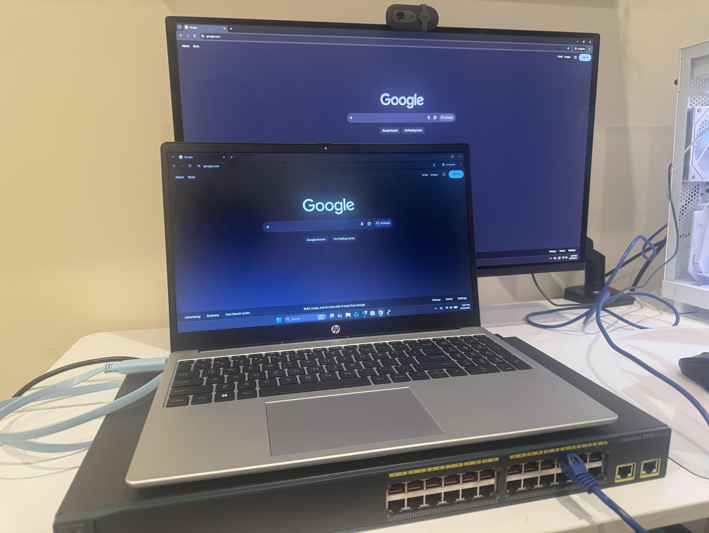
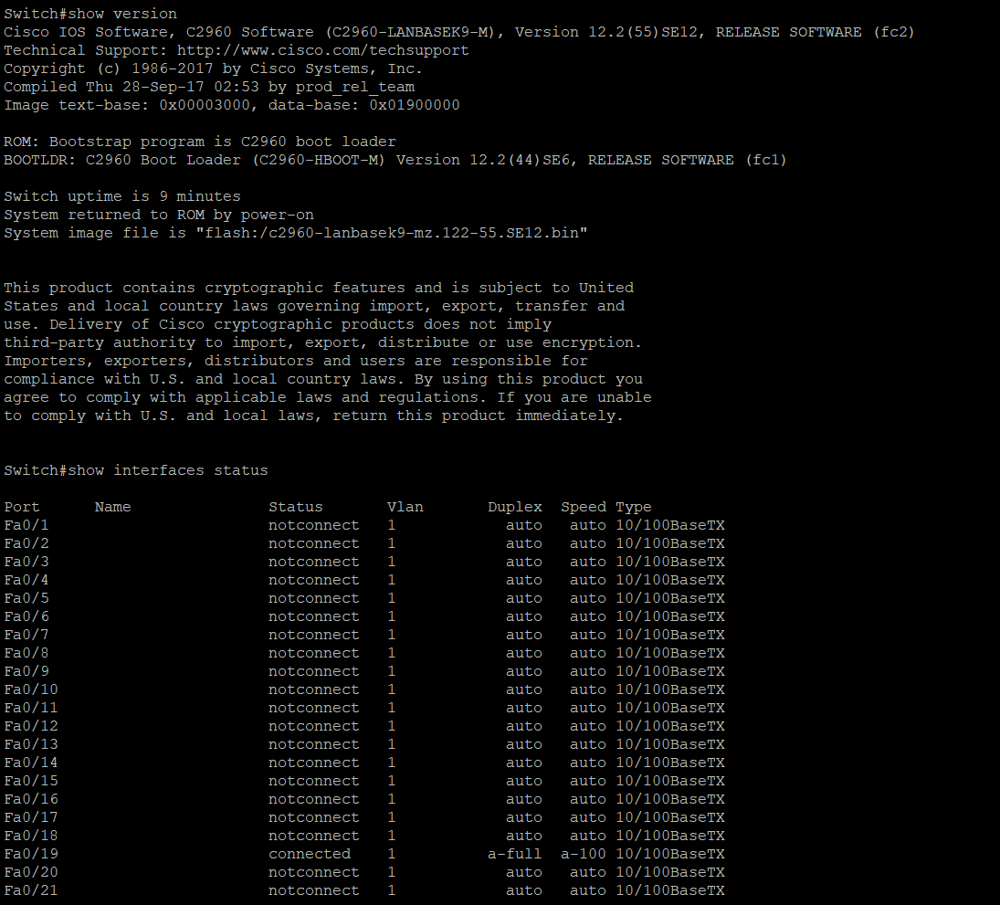
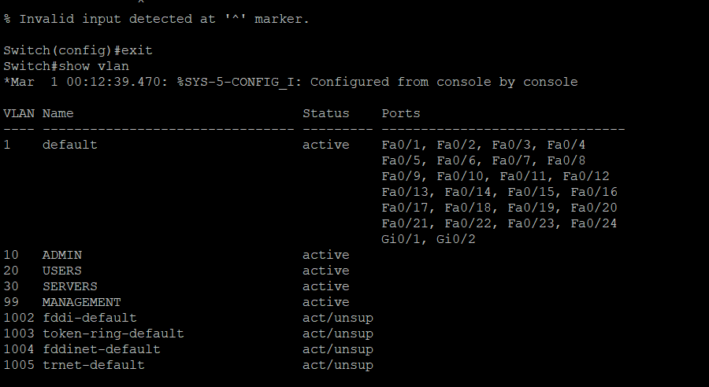
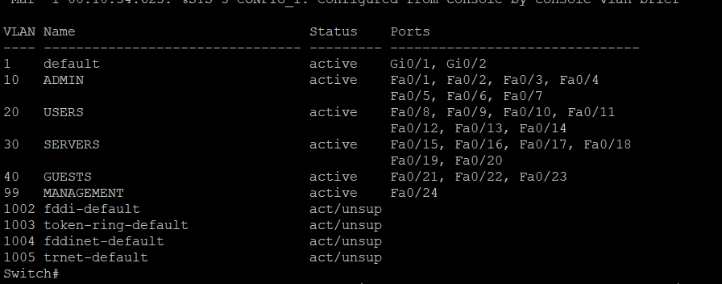
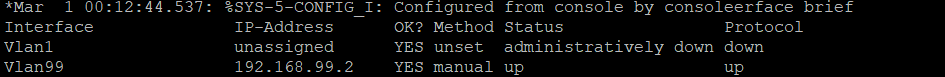
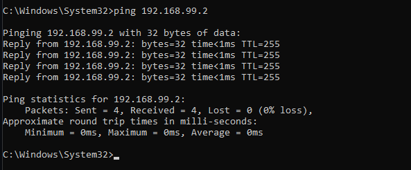

# Physical Cisco Catalyst 2960 Networking Lab

## Overview

Hands-on networking lab using a physical Cisco Catalyst 2960 switch to develop practical skills in Cisco IOS administration, VLAN segmentation, switchport configuration, network management, SSH remote administration, and Layer 2 troubleshooting.

The lab was built from a factory-reset configuration and progressively configured to simulate a small enterprise network environment.

## Objectives

* Perform initial configuration of a Cisco Catalyst 2960
* Configure and segment a network using VLANs
* Assign physical switchports to appropriate VLANs
* Configure a management SVI
* Establish IP connectivity between a Windows PC and the switch
* Configure and test SSH remote administration
* Analyze MAC address learning
* Practice switchport and VLAN troubleshooting
* Document network configuration and troubleshooting procedures

## Hardware

* Cisco Catalyst 2960
* Windows PC
* Cisco console cable
* Ethernet cable

## Network Design

| VLAN | Name       | Purpose                | Ports     |
| ---: | ---------- | ---------------------- | --------- |
|   10 | ADMIN      | Administrative devices | Fa0/1–7   |
|   20 | USERS      | End-user devices       | Fa0/8–14  |
|   30 | SERVERS    | Server devices         | Fa0/15–20 |
|   40 | GUESTS     | IT/network devices     | Fa0/21–23 |
|   99 | MANAGEMENT | Switch management      | Fa0/24    |

### Management Addressing

| Device               | IP Address    | Subnet Mask   |
| -------------------- | ------------- | ------------- |
| Cisco 2960 — VLAN 99 | 192.168.99.2  | 255.255.255.0 |
| Windows PC           | 192.168.99.10 | 255.255.255.0 |

## Topology

```text
                  Windows PC
              192.168.99.10/24
                      |
                 Ethernet Cable
                      |
                    Fa0/24
                   VLAN 99
                      |
              +---------------+
              |  Cisco 2960  |
              |     SW1      |
              +---------------+
                      |
               VLAN 99 SVI
               192.168.99.2
```

## Configuration

### Initial Switch Configuration

The switch was factory reset before beginning the lab. Initial configuration included:

* Hostname configuration
* Privileged EXEC authentication
* Console access configuration
* VTY access configuration
* Basic switch identification and verification

### VLAN Configuration

Five VLANs were created to simulate separate network segments:

```text
VLAN 10 - ADMIN
VLAN 20 - USERS
VLAN 30 - SERVERS
VLAN 40 - GUESTS
VLAN 99 - MANAGEMENT
```

Physical access ports were assigned to their respective VLANs using Cisco IOS interface-range configuration.

### Management SVI

VLAN 99 was configured as the switch management interface:

```text
interface vlan 99
 description SWITCH-MANAGEMENT
 ip address 192.168.99.2 255.255.255.0
 no shutdown
```

The Windows PC was configured with:

```text
IP Address: 192.168.99.10
Subnet Mask: 255.255.255.0
```

Connectivity was verified using ICMP ping.

## SSH Remote Management

SSH was configured to allow secure remote administration of the switch.

Configuration included:

* Local administrative user
* Domain name configuration
* RSA key generation
* SSH version 2
* Local authentication
* SSH-only VTY access

The configuration was verified by establishing an SSH session from the Windows PC:

```text
ssh admin@192.168.99.2
```

Successful authentication provided remote access to the Cisco IOS command line.

## Verification

The following Cisco IOS commands were used to verify the configuration:

```text
show version
show vlan brief
show interfaces status
show ip interface brief
show mac address-table
show ip ssh
show users
show running-config
```

These commands were used to verify:

* Switch hardware and IOS information
* VLAN creation and port assignments
* Physical interface status
* Management SVI status
* MAC address learning
* SSH functionality
* Active management sessions
* Running configuration

## Troubleshooting

### VLAN Connectivity

A management connectivity issue was investigated after configuring the switch and Windows PC.

The troubleshooting process involved verifying:

```text
show vlan brief
show interfaces status
show ip interface brief
show running-config interface fa0/24
```

The issue was isolated to the Layer 2 VLAN/port configuration and corrected by restoring the management port to VLAN 99.

Connectivity was then verified with:

```text
ping 192.168.99.2
```

### Troubleshooting Methodology

The lab follows a structured troubleshooting process:

1. Identify the symptoms
2. Verify physical connectivity
3. Check interface status
4. Verify VLAN assignment
5. Verify IP addressing
6. Inspect MAC address learning
7. Identify the configuration fault
8. Apply the correction
9. Test connectivity
10. Document the resolution

## Skills Demonstrated

* Cisco IOS CLI
* VLAN configuration
* VLAN segmentation
* Access-port configuration
* Switchport troubleshooting
* TCP/IP fundamentals
* IPv4 addressing
* Subnetting
* SVI configuration
* SSH remote administration
* MAC address table analysis
* Layer 2 troubleshooting
* Basic switch security
* Network documentation

## Screenshots

### Physical Lab Setup



### Switch Hardware and IOS



### VLAN Configuration



### Port Assignments



### Management SVI



### Successful Connectivity



### SSH Remote Administration


### MAC Address Learning


### Troubleshooting


## Lessons Learned

This project provided hands-on experience configuring and troubleshooting a physical Cisco switch rather than relying solely on network simulations. The lab reinforced the relationship between physical switchports, VLANs, IP addressing, MAC address learning, and management access.

The troubleshooting exercises also demonstrated the importance of systematically isolating problems at the physical, Layer 2, and Layer 3 levels.

## Future Improvements

Planned extensions to the lab include:

* Add a second Cisco switch
* Configure an 802.1Q trunk
* Extend VLANs across multiple switches
* Configure inter-VLAN routing using a Layer 3 device
* Implement additional switch security controls
* Add monitoring and network logging
* Integrate the lab with a larger home network environment
